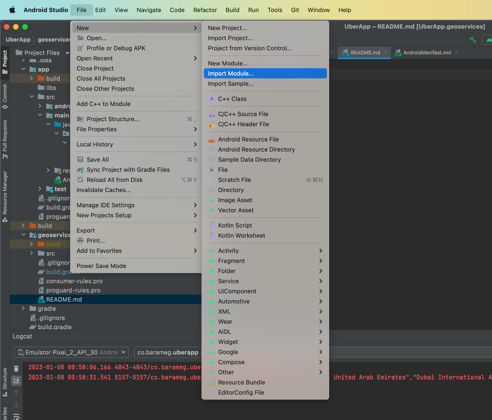
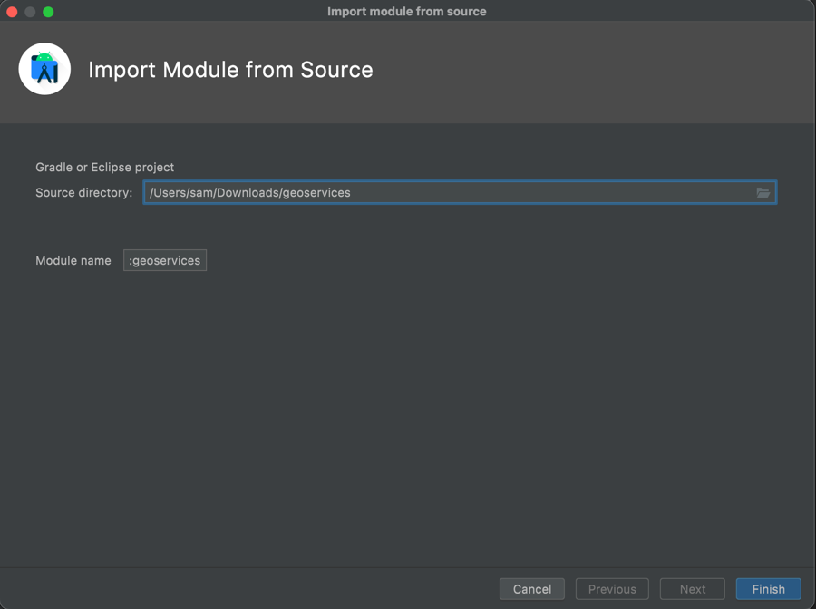
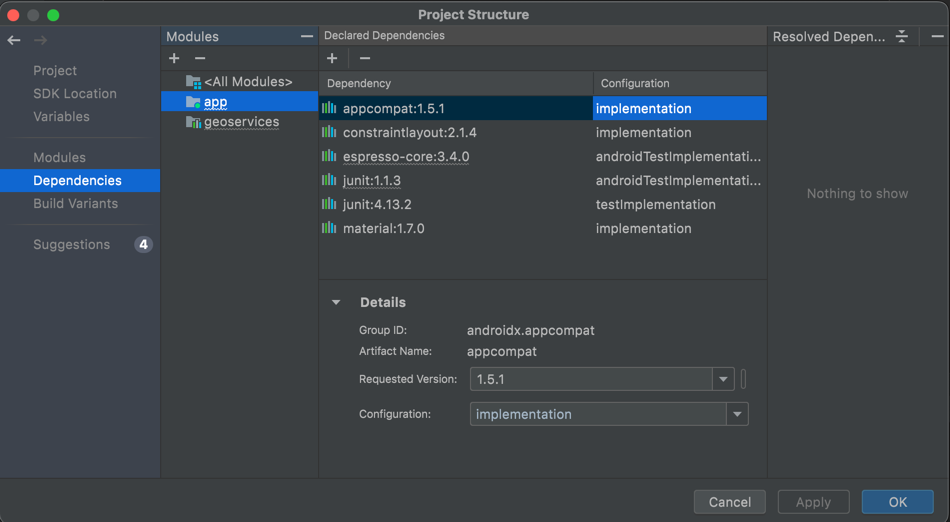
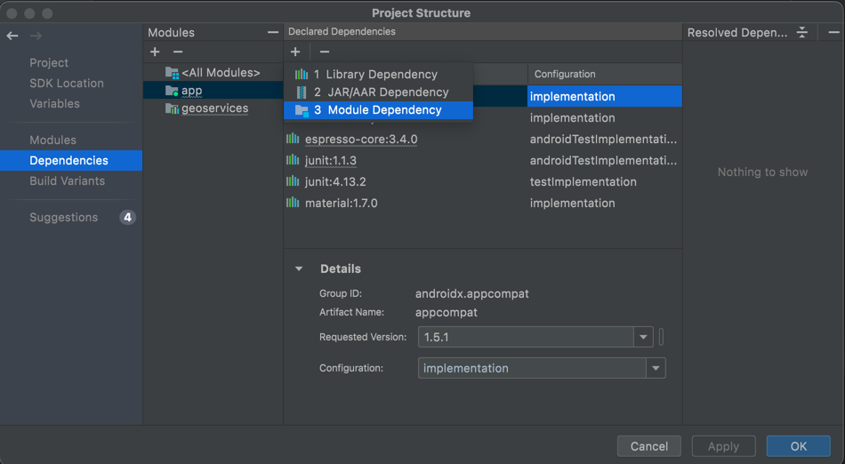
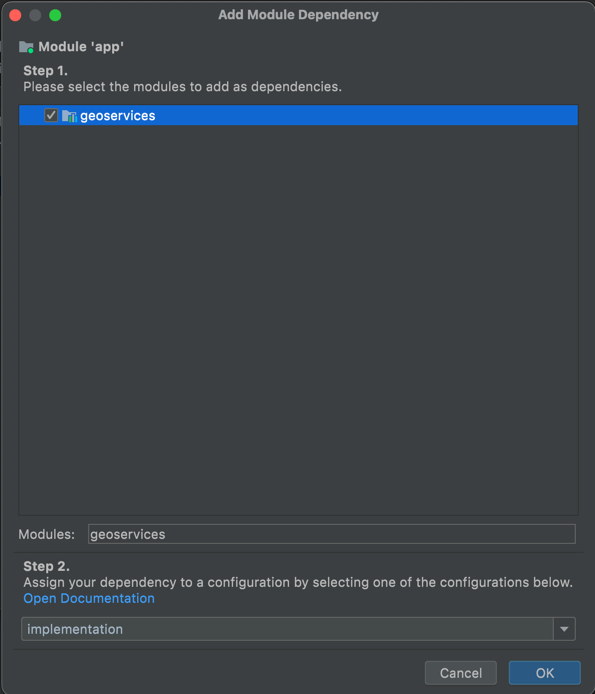

# Location Services SDK

## Description

The purpose of the SDK is to provide an affordable alternative to google maps / TomTom / Mapbox location services API, such as search, geocoding and routes.
## Usage

### Account
In order to be able to use the SDK you will need `client_id` and `client_key`, you can register an account at [locationbased.services](https://locationbased.services) for free, and you will get access to those values in your account dashboard. 

### Code

In order to access the class and its methods, you have to follow below steps 
- Import the sdk to your android project by navigating to `File > New > Import Module `



- Specify the path to the SDK folder and click Finish



- Navigate to ` File > Project Structure > Dependencies ` and select your project from the Modules pane



- Click the add + button on the declared Dependencies and choose Module Dependency



- Select the SDK from the menu and click OK



- Now you can import the class in your code using 

```
import co.barameg.geoservices.Geoservices
```

- DO NOT forget to make sure that your project has permissions to access internet in the `AndroidManifest.xml` file

```
    <uses-permission android:name="android.permission.INTERNET" />
    <uses-permission android:name="android.permission.ACCESS_NETWORK_STATE" />
```
#
### Methods

#### searchAutocomplete
___
```
val searchAutocomplete: String = Geoservices().searchAutocomplete(
    client_id = client_id,
    client_key = client_key,
    language = "en",
    country = "us",
    query = "dubai"
)
```
`searchAutocomplete` method returns an array of up to 5 suggestions in a form of json string, here is an example response
```
[
    "Dubai - United Arab Emirates",
    "Dubai International Airport (DXB) - Dubai - United Arab Emirates",
    "The Dubai Mall - Dubai - United Arab Emirates",
    "Dubai Restaurant and Hookah Bar, Besarabka, Kyiv, Ukraine",
    "Dubai Airport Terminal 2 Arrivals - Dubai - United Arab Emirates"
]
```
#
#### forwardGeocoding
___
```
val forwardGeocoding: String = Geoservices().forwardGeocoding(
    client_id = client_id,
    client_key = client_key,
    language = "en",
    country = "us",
    query = "The Dubai Mall - Dubai - United Arab Emirates"
)
```
`forwardGeocoding` method returns an object with latitude and longitude coordinates in a form of json string, here is an example response
```
{"latitude":25.198764999999998,"longitude":55.2796053}
```
#
#### reverseGeocoding
___
```
val reverseGeocoding: String = Geoservices().reverseGeocoding(
    client_id = client_id,
    client_key = client_key,
    language = "en",
    country = "us",
    latitude = "25.198764999999998",
    longitude = "25.198764999999998"
)
```
`forwardGeocoding` method returns a string containing the address that corresponds to the coordinates provided, here is an example response
```
"5 Abu Obiedah Bin Al Jarah St - Al Bu Daniq - Sharjah - United Arab Emirates"
```
#
#### routes
___
```
val routes: String = Geoservices().routes(
    client_id = client_id,
    client_key = client_key,
    origin_latitude = "25.198764999999998",
    origin_longitude = "25.198764999999998",
    destination_latitude = "25.198764999999998",
    destination_longitude = "25.198764999999998"
)
```
`routes` methods returns an array containing the possible routes between origin and destination

```
[
    {
        "coordinates": [
            {
                "x": 55.279678,
                "y": 25.198905
            },
            {
                "x": 55.280445,
                "y": 25.198493
            },
            {
                "x": 55.280796,
                "y": 25.198432
            }, 
        ],
        "routeName": "D68 - Al Khail St; D62 - Beirut St Al Qusais 3 القصيص; S113 - Al Wahda St",
        "totalLength": 30012,
        "totalSeconds": 3098,
        "passesThroughDangerArea": false,
        "isToll": true,
        "isHOV": false,
        "isFastest": true,
        "jams": [
            {
                "id": 48806416,
                "severity": 1,
                "line": [
                    {
                        "x": 55.382221,
                        "y": 25.306135
                    },
                    {
                        "x": 55.381729,
                        "y": 25.306515
                    },
                    {
                        "x": 55.379925,
                        "y": 25.30789
                    }, 
                ]
            }, 
        ],
        "tollPrice": 4,
        "tollPriceCurrencyCode": "AED"
    },
]
```
